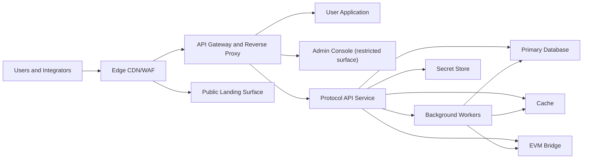

# Architecture Overview

## What this is

This document describes the logical architecture of UCMC: component boundaries, request flow, signature verification flow, and why core design decisions were made.

## System topology

## Service boundary model

UCMC separates public interaction, privileged operations, protocol execution, and storage into distinct logical surfaces. State-changing operations are handled as signed protocol signals and recorded in an event-sourced audit chain.

### Surface separation

| Surface | Audience | Purpose |
|---|---|---|
| User application | External users | Marketplace, identity, settlement, and verification workflows |
| Admin console | Authorized operators | Restricted governance and operational supervision |
| Landing surface | Public visitors | Public protocol and policy information |

### Backend processing model

Startup follows a deterministic sequence:

1. Load runtime secrets from secrets infrastructure.
2. Initialize observability and error tracking infrastructure.
3. Verify database readiness and apply migrations.
4. Start stream and projection subsystems.
5. Start API serving.

### Middleware and request lifecycle

At a high level, requests pass through security headers, request identification, origin checks, health and draining guards, payload parsing, route dispatch, and structured error handling.

### Public API layer map

All public routes are mounted under `/api`.

| Layer | Routes | Access model |
|---|---|---|
| 1 — Identity | `/auth`, `/onboarding`, `/kyc` | Public + rate-limited |
| 2 — Profiles | `/profile`, `/portfolio`, `/listing` | Public + rate-limited |
| 3 — Discovery | `/marketplace`, `/match` | Public + rate-limited |
| 4 — Protocol | `/challenge`, `/control`, `/capability`, `/read`, `/value` | Public + rate-limited |
| 5 — Content | `/delivery`, `/analytics`, `/storage`, `/templates` | Public + rate-limited |
| 6 — Disputes | `/dispute`, `/support` | Public + rate-limited |
| 7 — Reputation | `/reputation` | Public + rate-limited |
| 8 — Communication | `/messaging`, `/notification`, `/stream`, `/events` | Public + rate-limited |
| 9 — Financial | `/payment`, `/wallet`, `/tax` | Public + rate-limited |
| 10 — Legal | `/legal`, `/compliance` | Public + rate-limited |
| 11 — Recovery | `/recovery` | Public + rate-limited |
| 12 — Safety | `/moderation`, `/fraud` | Public + rate-limited |
| 13 — Governance | `/governance`, `/automation`, `/apm` | Public + rate-limited |
| 14 — Audit | `/audit` | Public + rate-limited |

## Event sourcing and signed-write protocol

UCMC records protocol-relevant state changes as signed events. A canonical payload is constructed with the `UCMC_AUTH_PAYLOAD_V4` domain, wrapped with `UCMC_VERIFY_V6`, then signed with the actor's Ed25519 private key. The API verifies signature validity and replay constraints before dispatching business logic and committing the resulting event record.

### Signed mutation flow (example signal `0x53`)

1. Client constructs canonical payload under `UCMC_AUTH_PAYLOAD_V4`.
2. Client wraps payload in `UCMC_VERIFY_V6` envelope and signs it.
3. Request includes actor identity fields, signature, signal, metadata, timestamp, and nonce.
4. Edge and gateway forward the request to the protocol API.
5. API verifies request structure, reconstructs canonical payload, validates signature, and enforces replay protection.
6. API dispatches domain logic and appends resulting events to the audit chain.
7. API returns commit status and trace metadata.

### Signed read flow

1. Client builds read preimage: `UCMC_READ_AUTH_V1:actorId:timestamp:nonce:path`.
2. Client computes SHA-256 digest and signs raw digest bytes with Ed25519.
3. Client sends signature headers (`x-actor-id`, `x-public-key`, `x-timestamp`, `x-nonce`, `x-signature`).
4. API rebuilds the preimage, verifies digest signature, and claims nonce once.
5. Authorized read handler returns response data.

## Trust kernel role

The trust kernel is the protocol verification boundary that validates actor signatures, policy preconditions, replay constraints, and signal semantics before state transitions are accepted. This preserves deterministic verification and auditable causality across settlement and governance flows.

## External integration categories

UCMC integrates with category-level external capabilities only: payments provider, KYC provider, object storage, edge CDN/WAF, and observability/secrets infrastructure.

## Design rationale

### Why container-first deployment before full cluster orchestration?

The architecture prioritizes deterministic startup, operational simplicity, and reproducible local parity while preserving portability to larger orchestration environments.

### Why ESM module boundaries?

ESM keeps import/export semantics explicit and consistent across services, which improves dependency clarity and reduces runtime ambiguity.

### Why route-lite frontend navigation?

Route-lite navigation reduces client complexity and keeps protocol state transitions explicit in signed API calls rather than hidden behind deep client routing state.

### Why separate reverse-proxy configurations by surface?

Separate proxy configurations preserve surface isolation between user and restricted interfaces, reducing blast radius and supporting independent hardening policies.
