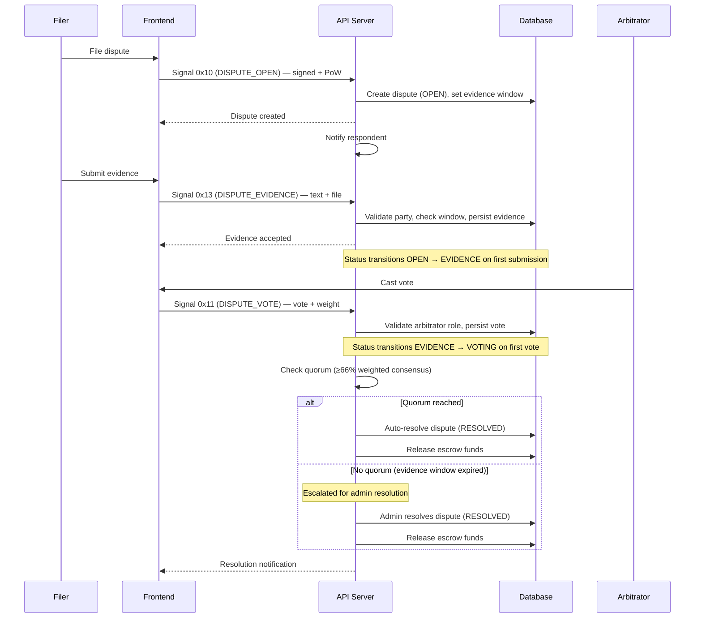

# Flow: Disputes

## Overview

Either party in an escrow contract can file a dispute. The dispute opens an evidence submission window (configurable via governance, default 72 hours), during which both filer and respondent can submit text evidence and file attachments. Arbitrators (actors with the `ARBITRATOR` role) cast weighted votes. If ≥66% weighted consensus is reached, the dispute auto-resolves. Otherwise, the dispute is escalated for final resolution. On resolution, escrowed funds are released to the winning party (or split).

## Prerequisites

Any actor who is a party (filer or respondent) to an active escrow contract can open a dispute. Voting requires the `ARBITRATOR` role. An admin-escalation path exists for disputes that do not reach quorum.

## End-to-End Sequence



## Dispute Status State Machine

```
OPEN ──► EVIDENCE (first evidence submitted)
              │
              └──► VOTING (first vote cast)
                       │
                       ├──► RESOLVED (quorum reached or admin resolution)
                       │
                       └──► (escalated if no quorum)

OPEN ──► CANCELLED
```

**Outcome values:** `BUYER`, `SELLER`, `SPLIT`, `CANCELLED`

## Step-by-Step Breakdown

### Filing a Dispute

The filer submits a dispute form with:
- Counterparty reference
- Escrow trace ID
- Reason (20–1,500 characters)

Signal `0x10` (DISPUTE_OPEN) is sent as a signed request with proof-of-work. The backend validates the signature and PoW, creates the dispute record with status `OPEN`, and sets the evidence submission window based on the `dispute_response_sla_hours` governance parameter (default 72 hours, configurable 12–336 hours).

A `DISPUTE_RAISED` notification is sent to the respondent.

### Submitting Evidence

Either the filer or respondent can submit evidence during the open evidence window.

**Evidence format:**
- Text content: 10–5,000 characters
- Optional file attachment: `image/*` or `application/pdf`

File uploads go through the platform's storage service to object storage. Evidence is submitted via signal `0x13` (DISPUTE_EVIDENCE) with the dispute ID, content, and optional file key.

**Validations:**
- Actor must be a party to the dispute (filer or respondent)
- Evidence window must still be open
- Idempotency enforced on trace ID (duplicate submissions are silently ignored)

The other party is notified when evidence is submitted.

### Arbitrator Voting

Actors with the `ARBITRATOR` role may cast a vote on any open dispute.

Signal `0x11` (DISPUTE_VOTE) carries the dispute ID, vote value, and weight.

**Vote values:** `BUYER`, `SELLER`, `SPLIT`, `CANCELLED`

**Constraints:**
- Default vote weight: 1
- One vote per arbitrator per dispute (enforced by unique constraint)

**Auto-resolve:** After each vote, the system checks whether any outcome has reached ≥66% of total weighted votes. If so, the dispute auto-resolves with that outcome.

### Resolution and Fund Release

When a dispute is resolved (either by quorum or administrative action), escrowed funds are released according to the outcome:

| Outcome | Buyer Receives | Seller Receives |
|---------|---------------|-----------------|
| `BUYER` | Full escrow amount | 0 |
| `SELLER` | 0 | Full escrow amount |
| `SPLIT` | Remainder after split | floor(escrow / 2) — BigInt division |
| `CANCELLED` | Funds returned to originator | 0 |

The fund release moves the balance from `in_escrow` to `free` on the recipient's wallet.

## Governance Parameters

| Parameter | Default | Range |
|-----------|---------|-------|
| `dispute_arbitration_quorum` | 3 votes | 1–15 |
| `dispute_response_sla_hours` | 72 hours | 12–336 hours |
| `escrow_auto_release_days` | 14 days | 3–60 days |

## Data Persistence

Dispute state is persisted across three tables: the dispute record, evidence submissions, and arbitrator votes. The vote table enforces one vote per arbitrator via a unique constraint.

## Failure Modes

| Error | Cause | Recovery |
|-------|-------|----------|
| `evidence_window_closed` | Evidence submitted after deadline | Cannot submit more evidence after the window expires |
| `evidence_forbidden` | Actor is not a party to the dispute | Only filer or respondent can submit evidence |
| `not_arbitrator` | Actor lacks the ARBITRATOR role | Actor must be granted the arbitrator role |
| `already_resolved` | Dispute already has an outcome | No further action possible |

## Signal Summary

| Signal | Hex | Description |
|--------|-----|-------------|
| DISPUTE_OPEN | `0x10` | Party files a dispute against escrow contract |
| DISPUTE_VOTE | `0x11` | Arbitrator casts a weighted vote |
| DISPUTE_EVIDENCE | `0x13` | Party submits text/file evidence |
