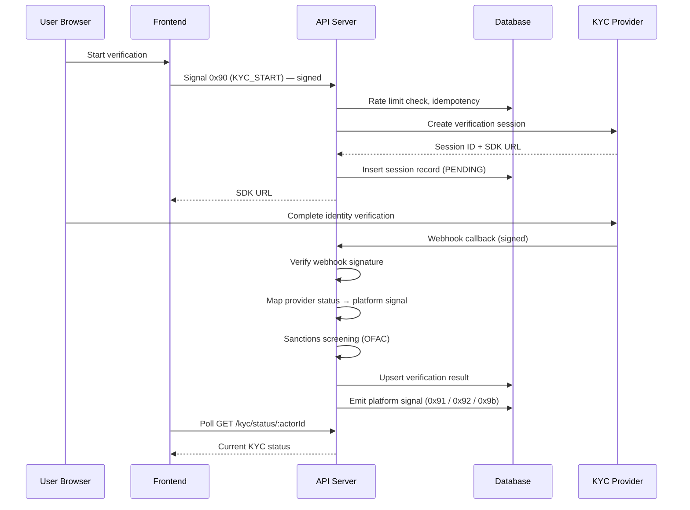

# Flow: KYC Verification

## Overview

A user initiates KYC verification, the backend creates a session with a third-party KYC provider, the user completes verification at the provider, the provider sends a webhook back, and the user is granted KYC-verified status (or rejected). KYC unlocks listing creation, withdrawals, and other compliance-gated actions.

## End-to-End Sequence



## Step 1: User Initiates Verification

The user triggers KYC from either the KYC panel or the onboarding wizard (Step 5). The frontend sends a signed request with signal `0x90` (KYC_START).

KYC can be deferred during onboarding — the wizard allows "Skip for now."

## Step 2: Backend Validates and Creates Session

The backend performs the following checks:

1. **Rate limit:** Maximum 3 sessions per 24 hours per actor (fail-open if cache is unavailable)
2. **Signed request validation:** body size, signal code (`0x90`), timestamp drift (±60 s), ZK proof, Ed25519 signature, event ingestion
3. **Already verified guard:** Returns `409 kyc_already_verified` if the actor's KYC status is already `VERIFIED`
4. **Session reuse:** Reuses an existing pending session if it is less than 30 minutes old

The backend then creates a session with the configured KYC provider, which returns a session ID and SDK URL. A session record is persisted with status `PENDING`.

## Step 3: User Completes at Provider

The user is redirected to the KYC provider's SDK URL in a new browser tab. They upload identity documents and complete face verification. This step happens entirely outside UCMC's control.

## Step 4: Webhook Callback

The KYC provider sends a signed webhook to the platform's callback endpoint.

**Webhook signature verification:**

The platform supports multiple KYC providers. Signature verification schemes vary:

| Scheme | Method |
|--------|--------|
| Hash-based | `SHA256(rawBody + SHA256(secret))` — constant-time comparison |
| HMAC | `HMAC-SHA256(rawBody, secret)` — constant-time comparison |
| Time-prefixed HMAC | Parse `t=<timestamp>,v1=<signature>` from header, reject if timestamp > 300 s old, compute `HMAC-SHA256("{timestamp}.{rawBody}", secret)` — constant-time comparison |

All schemes use constant-time comparison to prevent timing attacks.

**Status mapping:**

| Provider Status | Platform Signal | Hex |
|----------------|-----------------|-----|
| VERIFIED | KYC_VERIFIED | `0x91` |
| SANCTIONS_HIT | KYC_SANCTIONS_HIT | `0x9b` |
| Other (rejected, expired, etc.) | KYC_REJECTED | `0x92` |

## Step 5: Post-Verification Processing

After webhook receipt and signature verification:

1. **Sanctions screening:** OFAC SDN list (cached 24 hours), exact normalized name match. Fails open if the OFAC data source is unavailable.
2. **Document deduplication:** SHA-256 hash of document number (with domain prefix `UCMC_DOC_DEDUP_V1:`), checked against a unique index to prevent the same document from being used by multiple actors.
3. **Database upsert:** KYC result persisted with status, verification/rejection timestamp, rejection reason (if applicable), and provider reference.
4. **Platform signal emitted:** Cryptographically signed event written to the audit ledger.
5. **Notification:** Fire-and-forget notification sent to the user.
6. **Sanctions alert:** On `SANCTIONS_HIT`, a critical-severity alert is raised.

## Step 6: Frontend Status Propagation

The frontend polls the KYC status endpoint at regular intervals:
- Normal polling: every 30 seconds
- While `PENDING`: every 5 seconds

A window event (`compliance:kyc-changed`) triggers an immediate refresh when the status changes.

**Status display priority:** `VERIFIED` > `REJECTED` > `SANCTIONS_HIT`

## KYC Status State Machine

```
NOT_STARTED ──► PENDING ──► VERIFIED
                   │
                   ├──► REJECTED (retry allowed if under max retries)
                   │
                   ├──► PENDING_REVIEW ──► VERIFIED (admin approval)
                   │                  └──► REJECTED (admin rejection)
                   │
                   └──► SANCTIONS_HIT
```

**All status values:** `NOT_STARTED`, `PENDING`, `PENDING_REVIEW`, `VERIFIED`, `REJECTED`, `EXPIRED`, `SANCTIONS_HIT`

An admin review queue exists for sessions requiring manual decision, protected by separate admin authentication.

## Data Persistence

KYC state is persisted across four tables:
- **Sessions** — one record per verification attempt (session ID, provider, status)
- **Results** — one record per actor (latest verification outcome, timestamps)
- **Sanctions flags** — record of name matches against sanctions lists
- **Compliance freezes** — active restrictions preventing financial operations

## Failure Modes

| Error | Cause | Recovery |
|-------|-------|----------|
| `kyc_already_verified` | Actor already has VERIFIED status | No action needed |
| `kyc_rate_limited` | Exceeded 3 sessions in 24 hours | Wait and retry |
| `kyc_session_creation_failed` | KYC provider API unavailable | Retry; platform returns 502 |
| `webhook_signature_invalid` | Tampered or malformed webhook | Webhook rejected; no status change |
| `document_duplicate` | Same document used by another actor | Investigation required; possible fraud signal |
| `sanctions_hit` | Name matches OFAC SDN list | Account frozen pending manual review |

## Signal Summary

| Signal | Hex | Description |
|--------|-----|-------------|
| KYC_START | `0x90` | User initiates KYC verification |
| KYC_VERIFIED | `0x91` | Verification successful |
| KYC_REJECTED | `0x92` | Verification failed |
| KYC_SANCTIONS_HIT | `0x9b` | Sanctions screening match |
