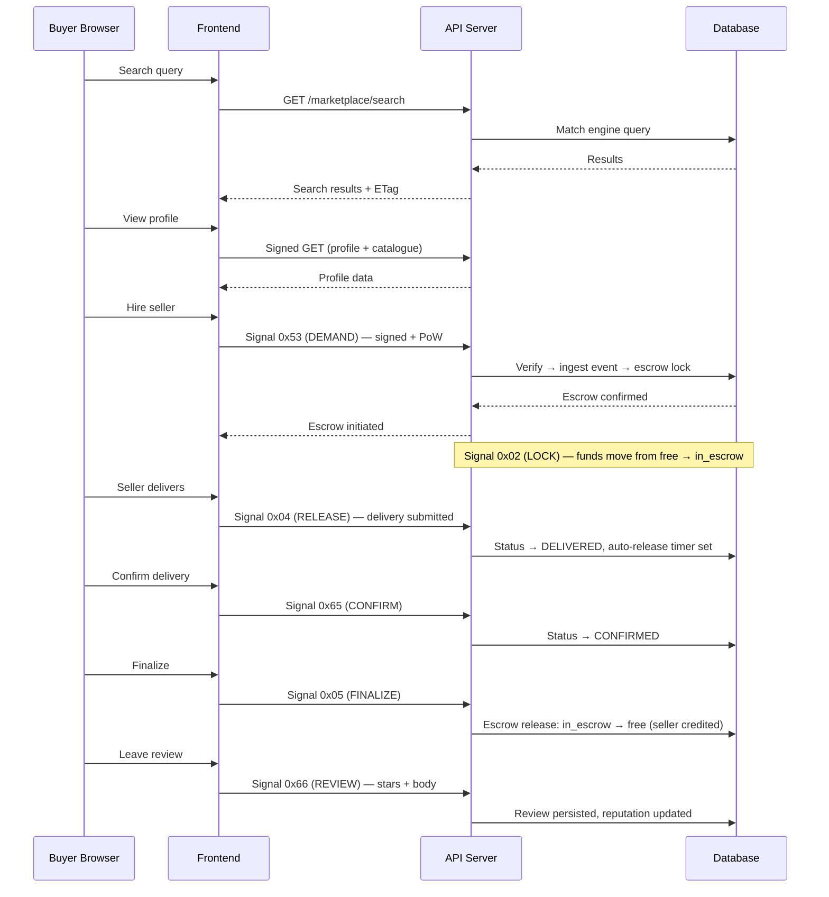

# Flow: Marketplace Transaction

## Overview

A buyer searches the marketplace for professionals, views a seller's profile and service catalogue, hires them via a cryptographically signed escrow signal, funds are locked in escrow, the seller delivers, the buyer confirms delivery, funds release to the seller, and the buyer leaves a review. Every action in this chain is Ed25519-signed, proof-of-work mined, and logged to an immutable event ledger.

## Prerequisites

Any authenticated user with an identity keypair can search and browse. Hiring requires a funded wallet (free balance ≥ catalogue price). Listing requires KYC verification, seller agreement, and a completed tax profile.

## End-to-End Sequence



## Step-by-Step Breakdown

### Step 1: Search

The frontend debounces search input and calls the marketplace search endpoint with query parameters.

**Endpoint:** `GET /marketplace/search?q=...&category=...&tags=...&minPrice=...&maxPrice=...&sort=...&page=...&limit=12`

The backend invokes the matching engine and returns results with a commitment hash for cache coherence (single-flight cache + ETag).

**Filter options:**

| Filter | Values |
|--------|--------|
| Categories | `ALL`, `EDUCATION`, `CREATIVE`, `GAMING`, `TECH`, `LEGAL`, `FINANCE`, `HEALTH`, `OTHER` |
| Price buckets | `ANY`, `UNDER_500`, `500_1000`, `1000_5000`, `5000_10000`, `OVER_10000` |
| Sort | `relevance`, `price_asc`, `price_desc`, `reputation`, `newest` |
| Tags | Top 10 by frequency from results; max 8 active |

### Step 2: View Profile

The buyer loads a seller's profile and catalogue via a signed GET request.

**Displayed fields:** avatar, display name, @username, KYC verification badge, bio, category/subcategory, skill tags, external links.

**Catalogue items:** title, description, price, delivery time (days), tags.

### Step 3: Hire (Escrow Initiation)

The buyer sends signal `0x53` (DEMAND) targeting the seller's actorId.

**Signal metadata:**
```json
{
  "catalogue_id": "<id>",
  "catalogue_title": "<title>",
  "catalogue_price": "<amount>",
  "delivery_days": 14
}
```

**Signing pipeline:**
1. Validate request parameters
2. Idempotency check (deduplicate repeated submissions)
3. Hash metadata into canonical form
4. Mine proof-of-work nonce (SHA-256, 16 leading zero bits)
5. Sign with Ed25519 under `UCMC_AUTH_PAYLOAD_V4` domain
6. Submit to the platform's signed-write endpoint

The backend verifies the signature and proof-of-work, ingests the platform event, and writes to the state log, control log, and idempotency tables atomically.

### Step 4: Escrow Lock

Lock signal `0x02` (LOCK) creates the escrow hold. The wallet mutation atomically moves funds from `free` balance to `in_escrow` balance. A delivery record is created with status `PENDING`.

### Step 5: Delivery

The seller submits delivery signal `0x04` (RELEASE), transitioning the delivery status to `DELIVERED`.

**Delivery modes:**

| Mode | Description |
|------|-------------|
| `FILE` | Deliverable uploaded to object storage |
| `ACCESS` | Encrypted ciphertext with ephemeral key |
| `MANUAL` | Out-of-band delivery, seller marks complete |

**Auto-release:** If the buyer does not confirm within the governance-configured auto-release period (default 14 days), funds are released automatically.

### Step 6: Buyer Confirms

Signal `0x65` (CONFIRM) transitions the delivery from `DELIVERED` to `CONFIRMED`.

**Validations:**
- Caller must be the buyer on this contract
- Delivery must be in `DELIVERED` status (not already confirmed)
- Nonce checked for replay protection

**Error codes:** `delivery_not_found`, `not_buyer`, `already_confirmed`, `replay_detected`

### Step 7: Finalize and Fund Release

Signal `0x05` (FINALIZE) marks the contract complete. The escrow releases: funds move from `in_escrow` to `free` balance on the seller's wallet. A value log entry records the transfer.

### Step 8: Review

Signal `0x66` (REVIEW) allows the buyer (or seller) to leave a review for the completed contract.

**Signal metadata:**
```json
{
  "finalizeTraceId": "<hex>",
  "stars": 4,
  "body": "Excellent work, delivered on time.",
  "positiveTags": ["communication", "quality"],
  "negativeTags": []
}
```

**Constraints:**
- `stars`: integer 1–5
- `body`: max 500 characters
- One review per finalized contract per direction (enforced by database uniqueness on finalize trace ID + reviewer ID)

**Reputation update:** The platform's reputation summary is refreshed — `total_reviews`, `star_sum`, and `completed_count` are recalculated.

**Error codes:** `review_no_finalize`, `review_participants_mismatch`, `replay_detected`

## Data Shapes

### Search Request

```
GET /marketplace/search?q=node+developer&category=TECH&tags=react,typescript&minPrice=500&maxPrice=5000&sort=relevance&page=1&limit=12&actorId=<actorId>
```

### Search Response

```json
{
  "ok": true,
  "data": {
    "results": [
      {
        "actor_id": "<hex>",
        "display_name": "...",
        "category": "TECH",
        "tags": ["react", "typescript"],
        "starting_price": "500000000",
        "reputation": {
          "total_reviews": 12,
          "star_sum": 57,
          "completed_count": 15
        },
        "final_score": 0.87,
        "signal_score": 0.72,
        "profile_score": 0.91,
        "cold_start": false
      }
    ],
    "total": 42,
    "hasMore": true,
    "commitment": "<hex>"
  }
}
```

### Hire Signal Body

```json
{
  "actorId": "<hex>",
  "targetId": "<hex>",
  "signal": "0x53",
  "metadata": {
    "catalogue_id": "cat_001",
    "catalogue_title": "Full-Stack Node.js Development",
    "catalogue_price": "2000000000",
    "delivery_days": 14
  },
  "idempotencyKey": "idem_...",
  "timestamp": 1779539006897,
  "nonce": "<hex>",
  "traceId": "<hex>",
  "publicKey": "<ed25519_pub_hex>",
  "signature": "<ed25519_sig_hex>",
  "proof": {
    "contextHash": "<sha256_hex>",
    "proofHash": "<sha256_hex>"
  }
}
```

## Signal Summary

| Step | Signal | Hex | Description |
|------|--------|-----|-------------|
| Hire | DEMAND | `0x53` | Buyer initiates escrow with seller |
| Lock | LOCK | `0x02` | Funds moved to escrow hold |
| Deliver | RELEASE | `0x04` | Seller submits deliverable |
| Confirm | CONFIRM | `0x65` | Buyer confirms receipt |
| Finalize | FINALIZE | `0x05` | Contract marked complete, funds released |
| Review | REVIEW | `0x66` | Post-transaction reputation feedback |
