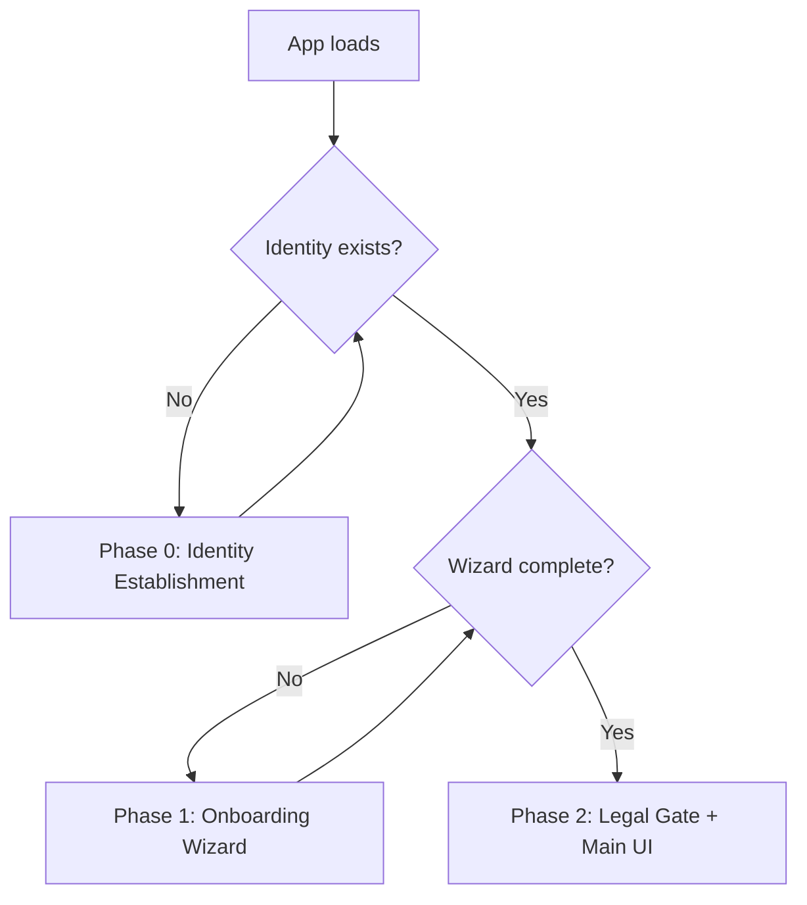
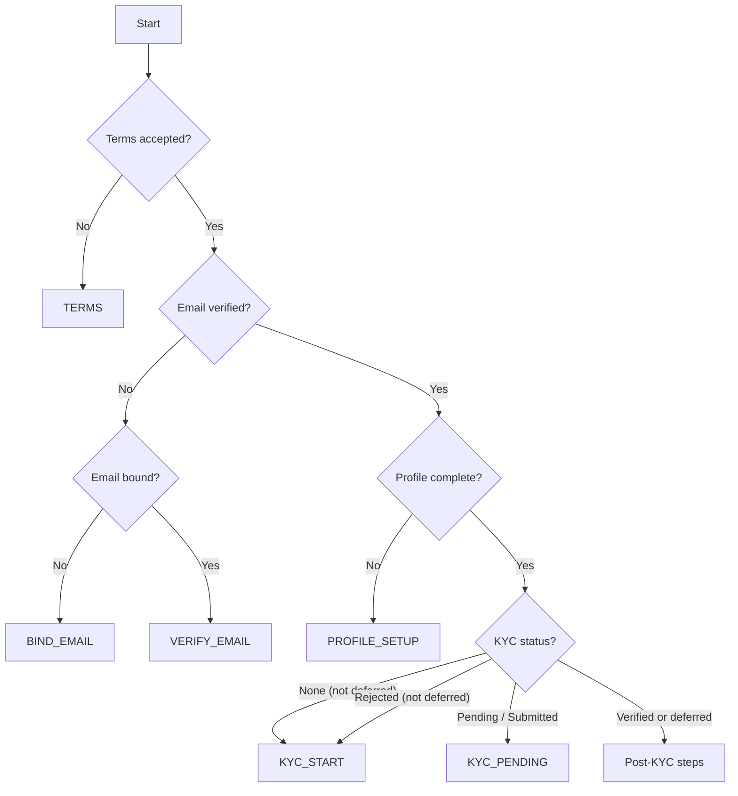
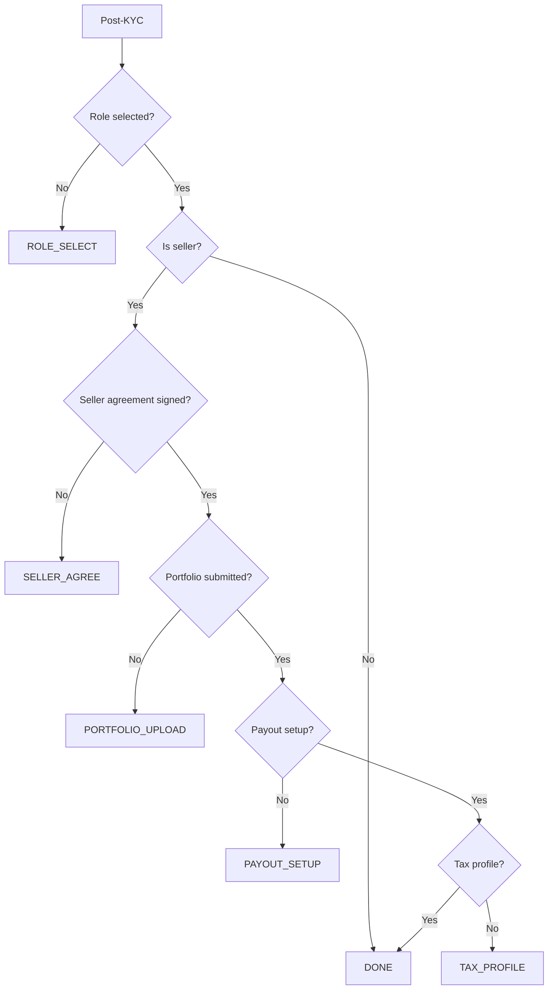

# Flow: Onboarding

## Overview

A new user goes through a three-phase gated onboarding: Phase 0 (identity establishment via OAuth or passphrase), Phase 1 (a 10-step wizard covering terms, email, profile, KYC, role selection, and seller-specific requirements), and Phase 2 (main dashboard with legal gate for ongoing document acceptance). The wizard adapts its step count based on role: buyers complete 6 steps, sellers complete all 10. KYC can be deferred during onboarding and completed later via the standalone KYC panel.

## Phase Routing

Returning users who have previously completed the wizard bypass it on subsequent sessions.

## Phase 0: Identity Establishment

The user creates their cryptographic identity via one of two paths:

- **Passphrase** (min 8 characters) → Ed25519 keypair derived from passphrase
- **OAuth** (supported OAuth providers) → PKCE flow → key exchange

After identity creation, passphrase users are guided through a recovery setup step.

## Phase 1: Onboarding Wizard

The wizard presents up to 10 steps. Buyers complete steps 1–6; sellers complete all 10.

| # | Step | What It Collects | Signal | Path |
|---|------|-----------------|--------|------|
| 1 | Terms of Service | Checkbox acceptance | `0x69` | Both |
| 2 | Email Address | Email address | `0x68` | Both |
| 3 | Verify Email | 6-digit OTP | — | Both |
| 4 | Profile Setup | Display name, @handle, legal name, avatar, bio | `0x61` | Both |
| 5 | Identity Verification | KYC session (or deferred) | `0x90` | Both |
| 5b | KYC Pending | Waiting for provider result | — | Both |
| 6 | Account Type | Buyer / Seller / Both | `0x61` | Both |
| 7 | Seller Agreement | Legal document signature | `0x93` | Seller |
| 8 | Portfolio | Portfolio items | — | Seller |
| 9 | Payout Setup | Payment method | `0x99` | Seller |
| 10 | Tax Information | Tax ID, country, entity type | `0xa9` | Seller |

### Step Progression

### Post-KYC Step Derivation

### Terms Acceptance

Signal `0x69` (TERMS_ACCEPT) — Ed25519 signed request. The backend ensures the actor entity exists, checks the device fingerprint to prevent one device from creating multiple accounts, and returns `409` on duplicate (idempotent).

### Email Binding

Signal `0x68` (BIND_EMAIL). The email is stored in two forms:
- **SHA-256 hash** for lookup (prevents plaintext storage)
- **AES-256-GCM encrypted** for dispatch (when the platform needs to send emails)

A 6-digit OTP is generated and stored as: `SHA-256("UCMC_EMAIL_OTP_V1:{actorId}:{otp}")`

**Protocol invariants:**
- OTP TTL: 15 minutes
- Maximum attempts: 5

### Email Verification

The user submits the 6-digit OTP. The backend performs constant-time comparison against the stored hash, atomically consumes the OTP on success, marks the email as verified, and emits an `EMAIL_VERIFIED` platform signal.

### Profile Identity Fields

Profile setup captures three distinct identity fields, each with a separate purpose:

| Field | Purpose | Visibility |
|-------|---------|------------|
| Display name | Friendly label shown next to the actor | Public |
| Handle (`@username`) | Unique public identifier used in profile URLs and mentions | Public, unique |
| Legal name | Full legal name used for identity verification against provider records | Private |

The distinction matters for compliance: KYC providers verify against a
government-issued **legal name**, which is neither the public display name nor
the handle. Collecting the legal name during profile setup is what makes
[KYC verification](./kyc.md) able to proceed.

### Identity Verification (KYC)

KYC is initiated with signal `0x90` (KYC_START) and can be deferred with "Skip
for now." The verification runs as an [owned, recoverable session](../architecture/external-workflow-sessions.md),
so an interrupted attempt during onboarding (blocked popup, closed tab, network
loss) can be resumed, retried, or cancelled rather than stranding the user. See
[flows/kyc.md](./kyc.md).

### Onboarding Completion

When all required gates are satisfied (terms accepted, KYC verified, email verified, profile complete), the platform emits signal `0xa8` (ONBOARDING_COMPLETE). This check is idempotent — duplicate emissions are suppressed.

### Role Selection

The user selects their account type:

| Role | Steps Required |
|------|---------------|
| `BUYER` | 1–6 |
| `SELLER` | 1–10 |
| `BOTH` | 1–10 |

## Phase 2: Legal Gate

After wizard completion, the user enters the main application. A legal gate intercepts if there are unsigned documents requiring acceptance.

The legal gate fetches pending documents, recomputes their content hashes client-side for integrity verification (SHA-256 against the stored `content_hash`), and accepts each with a signed action using signal `0x93` (LEGAL_SIGN) carrying metadata `{ documentId, contentHash }`.

## Onboarding Status

Onboarding mutations are signed via the standard request protocol; see the API specification for endpoint paths.

Onboarding status is computed by aggregating signals from identity, profile, KYC, email verification, compliance, and seller-readiness records. Status is recomputed on demand and cached opportunistically.

Onboarding completion is computed from terms acceptance, email verification, profile completeness, and (for sellers) the seller-specific steps.

## Data Persistence

Onboarding state is persisted across an onboarding record (role, terms acceptance, completion), email verification OTP records (hashed, time-limited, attempt-bounded), and a compliance state view aggregating verification gates.

## Failure Modes

| Error | Cause | Recovery |
|-------|-------|----------|
| `otp_expired` | OTP submitted after 15-minute TTL | Request a new OTP |
| `otp_max_attempts_exceeded` | More than 5 failed OTP attempts | Request a new OTP (previous one is invalidated) |
| `resend_too_soon` | OTP resend requested before cooldown | Wait before requesting again |
| `duplicate` | Terms already accepted | No action needed; idempotent |
| `device_already_registered` | Device fingerprint matches another actor | Multi-account prevention; contact support |
| `invalid_signature` | Ed25519 signature verification failed | Ensure correct keypair is being used |
| `timestamp_drift_exceeded` | Request timestamp outside ±60 s window | Synchronize device clock |
| `content_hash_mismatch` | Legal document integrity check failed | Document may have been tampered with; do not sign |

## Signal Summary

| Signal | Hex | Description |
|--------|-----|-------------|
| TERMS_ACCEPT | `0x69` | User accepts terms of service |
| BIND_EMAIL | `0x68` | User binds email to actor |
| BIND_ETH | `0x95` | User binds Ethereum address |
| KYC_START | `0x90` | Initiate KYC verification |
| KYC_VERIFIED | `0x91` | KYC verification successful |
| KYC_REJECTED | `0x92` | KYC verification failed |
| LEGAL_SIGN | `0x93` | Sign a legal document |
| PAYOUT_METHOD_SET | `0x99` | Configure payout method |
| TAX_PROFILE_SET | `0xa9` | Submit tax information |
| PROFILE_UPDATE | `0x61` | Update profile or select role |
| ONBOARDING_COMPLETE | `0xa8` | All onboarding gates satisfied |
