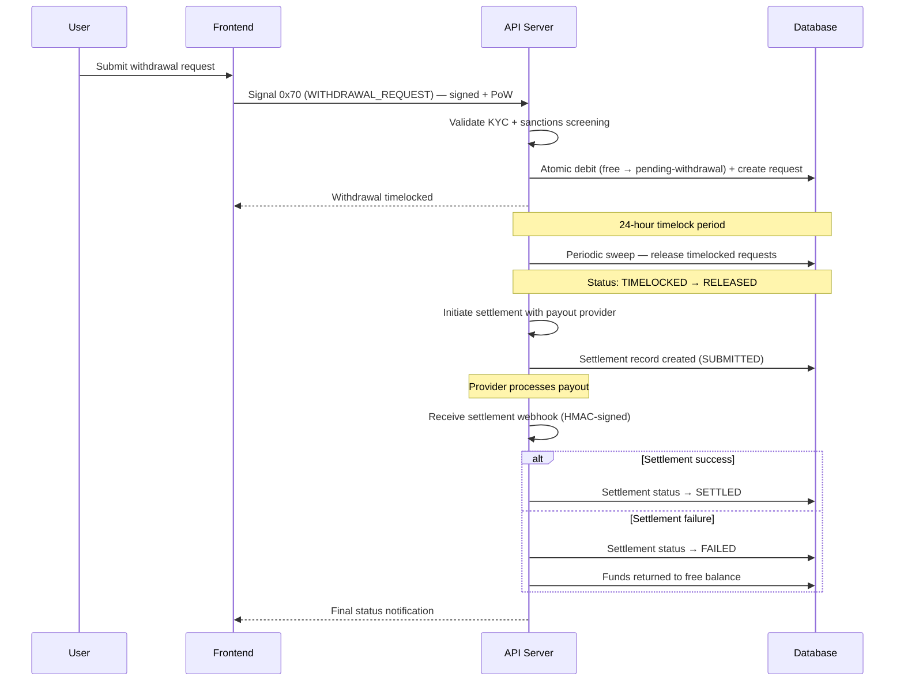

# Flow: Withdrawals

## Overview

A user requests a withdrawal from their wallet. The backend validates KYC status, enforces a governance-controlled minimum, runs a sanctions screening, then atomically debits the free balance and creates a 24-hour timelocked withdrawal request. After the timelock expires, a periodic sweep releases the funds. Settlement happens via fiat payout or direct crypto transfer, with webhook callbacks updating the final status.

## Prerequisites

The requesting actor must have KYC-verified status and no active compliance freezes. The withdrawal amount must meet the governance-configured minimum and not exceed the actor's free balance.

## End-to-End Sequence



## Withdrawal Status State Machine

```
(request submitted) ──► TIMELOCKED ──(24h sweep)──► RELEASED ──► SETTLED
                            │
                            └──(cancelled)──► CANCELLED (funds returned to free)
```

**Request statuses:** `PENDING`, `TIMELOCKED`, `RELEASED`, `CANCELLED`

**Settlement statuses:** `SUBMITTED`, `SETTLED`, `FAILED`

## Step-by-Step Breakdown

### Step 1: User Submits Withdrawal Request

The user submits a withdrawal form specifying:
- Amount
- Destination type: `CRYPTO` or `FIAT`
- Destination details: wallet address (crypto) or bank details (fiat payouts to supported regions)

Signal `0x70` (WITHDRAWAL_REQUEST) is sent as a signed request with proof-of-work.

### Step 2: Backend Validation

The backend validates:
1. **KYC required:** Actor must have verified KYC status with no active compliance freezes
2. **Signal check:** Must be `0x70`
3. **Ed25519 + PoW verification**
4. **Event ingestion** for idempotency
5. **Amount:** Positive BigInt string
6. **Destination type:** `CRYPTO` or `FIAT`

### Step 3: Withdrawal Processing

1. **Governance minimum:** The withdrawal amount must meet a configurable governance minimum
2. **Sanctions screening:** Actor is checked against sanctions lists. On a hit: the request is blocked, a sanctions flag is recorded, and the action is audited
3. **24-hour timelock:** The withdrawal enters a mandatory 24-hour hold period before funds can be released
4. **Atomic balance debit:** The balance debit and withdrawal record are committed atomically in a single transaction — the `free` balance is decremented and the pending-withdrawal balance portion is incremented by the same amount
5. **Deduplication:** Idempotency enforced on the request trace ID (duplicate submissions are silently ignored)

### Step 4: Timelock Sweep

A periodic background process scans for timelocked requests whose hold period has expired and transitions them to `RELEASED` status. The pending-withdrawal balance portion is decremented as funds are released for settlement.

If the timelock sweep finds an inconsistency, the discrepancy is logged for manual reconciliation.

### Step 5: High-Value Approval

Withdrawals above a high-value threshold enter an admin approval queue before the timelock releases. Admin actions are themselves authenticated and audited.

### Step 6: Threshold Signing

Very-high-value withdrawals can require N-of-M signatures from a multi-key keyring before release. Signing actions have a bounded TTL to prevent stale approvals from accumulating.

### Step 7: Settlement

Once released, the platform initiates settlement with the appropriate payout provider. Settlement is tracked as an [owned, recoverable session](../architecture/external-workflow-sessions.md): UCMC records the authoritative status and reconciles it against provider truth, so a delayed or missed callback does not leave a withdrawal in an indeterminate state. Any conversion to the destination currency is applied at this step.

**Webhook verification:** The payout provider sends an HMAC-signed callback with timing-safe comparison to confirm settlement outcome.

**Settlement outcomes:**
- **Success:** The withdrawal is marked `SETTLED`
- **Failure:** The withdrawal settlement is marked `FAILED`. Settlement failure events are surfaced for reconciliation.

## Balance Model

UCMC holds value on a native, per-currency ledger. Each actor holds **ledger positions** — one per currency received — rather than a single fungible balance. Within each currency position, value is tracked across three portions:

| Portion | Description |
|---------|-------------|
| `free` | Available for spending, hiring, or withdrawal |
| `in_escrow` | Locked in active escrow contracts |
| `in_withdrawal` | Held during the 24-hour timelock period |

All balance mutations are atomic — value moves between portions of a currency position within a single transaction to prevent double-spend. Value is held in the currency it was received in; any conversion to a withdrawal's destination currency happens only at settlement. See [architecture/multi-currency-ledger.md](../architecture/multi-currency-ledger.md).

## Deposits

Deposits follow a similar signed-request + provider-webhook pattern; see the API specification for endpoints.

## Failure Modes

| Error | Cause | Recovery |
|-------|-------|----------|
| `kyc_required` | Actor has not completed KYC | Complete KYC verification first |
| `wallet_withdrawal_below_minimum` | Amount below governance minimum | Increase withdrawal amount |
| `wallet_insufficient_free_balance` | Free balance too low | Wait for pending escrows to release or add funds |
| `wallet_sanctions_blocked` | Actor flagged by sanctions screening | Account frozen pending review |
| `account_frozen` | Active compliance freeze | Contact support |
| `replay` | Duplicate request trace ID | No action needed; idempotent |
| `wallet_invalid_destination_type` | Destination type not CRYPTO or FIAT | Correct the destination type |
| Sweep inconsistency | Balance mismatch during timelock release | Logged for manual reconciliation |
| Settlement failure | Payout provider rejects or reverses transfer | Funds returned; reconciliation initiated |
| Threshold action expired | Multi-key signing action timed out | Must re-initiate the signing process |

## Signal Summary

| Signal | Hex | Description |
|--------|-----|-------------|
| WITHDRAWAL_REQUEST | `0x70` | User initiates a withdrawal |
| DEPOSIT_INITIATE | `0x80` | User initiates a deposit |
